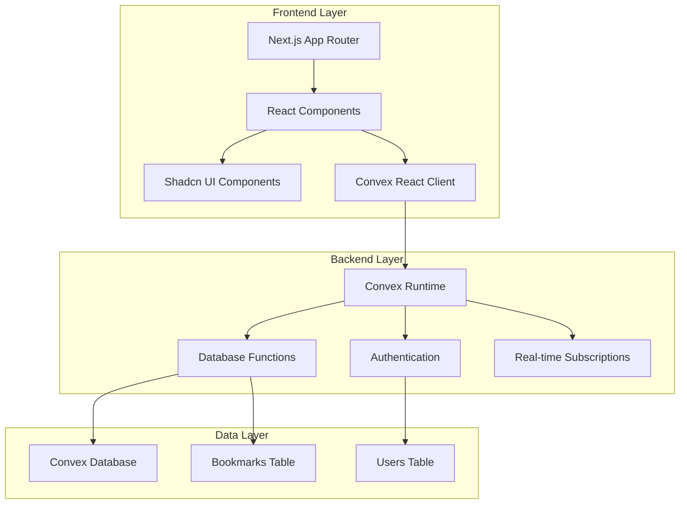
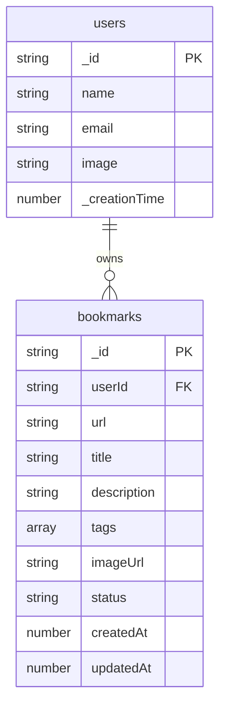
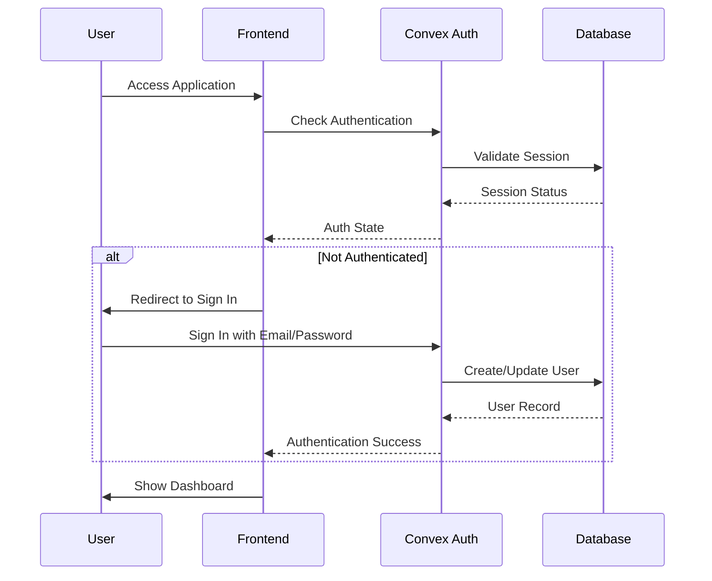
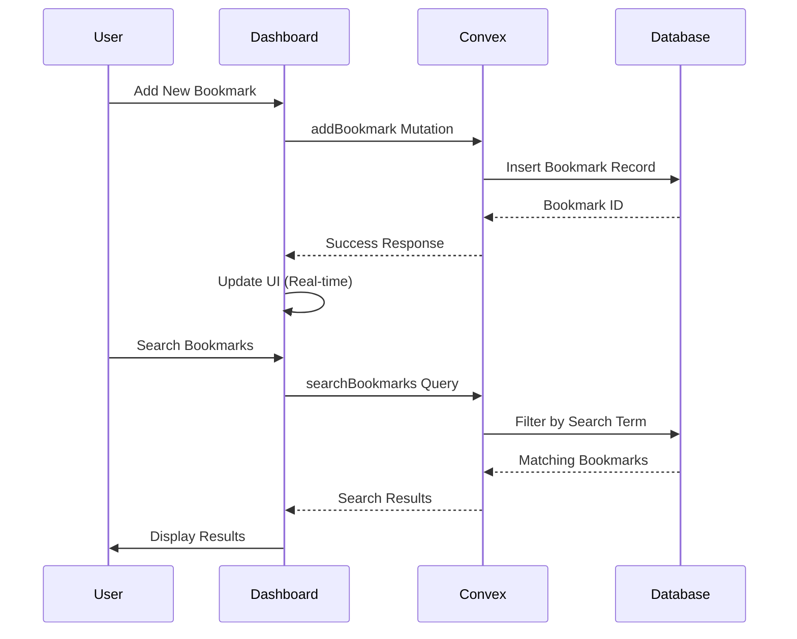

# System Architecture

## High-Level System Architecture

The Bookmarker application follows a modern serverless architecture with clear separation between frontend and backend concerns:

## Database Schema

The application uses Convex's document database with the following schema:

### Database Indexes
- `bookmarks.by_userId`: Efficient user bookmark queries
- `bookmarks.by_status`: Status-based filtering
- `bookmarks.by_userId_status`: Combined user and status queries

## High-Level Procedures

### User Authentication Flow

### Bookmark Management Flow

## Description of File Architecture

### Frontend Architecture (Next.js App Router)
- **`app/`**: Next.js 13+ App Router structure
  - `page.tsx`: Main application entry point
  - `layout.tsx`: Root layout with providers
  - `signin/`: Authentication pages
  - `globals.css`: Global styles and Tailwind CSS

### Component Architecture
- **`components/`**: Reusable React components
  - `BookmarkerDashboard.tsx`: Main dashboard component (self-contained)
  - `ConvexClientProvider.tsx`: Convex client wrapper
  - `ui/`: Shadcn UI component library (atomic design)

### Backend Architecture (Convex)
- **`convex/`**: Serverless backend functions
  - `schema.ts`: Database schema definition
  - `bookmarks.ts`: Bookmark CRUD operations
  - `auth.ts` & `auth.config.ts`: Authentication configuration
  - `_generated/`: Auto-generated TypeScript types

### Shared Resources
- **`lib/utils.ts`**: Utility functions and helpers
- **Configuration Files**: TypeScript, ESLint, Tailwind, and Convex configs

### Self-Sustained Components
- **BookmarkerDashboard**: Complete bookmark management interface
- **UI Components**: Atomic, reusable Shadcn components
- **Auth System**: Fully integrated with Convex Auth

## Critical Implementation Paths

1. **Authentication Flow**: `app/signin` → `ConvexClientProvider` → `auth.ts`
2. **Data Flow**: `BookmarkerDashboard` → `convex/bookmarks.ts` → `schema.ts`
3. **UI Rendering**: `page.tsx` → `BookmarkerDashboard` → `ui/components`
4. **Real-time Updates**: Convex subscriptions automatically update React components
